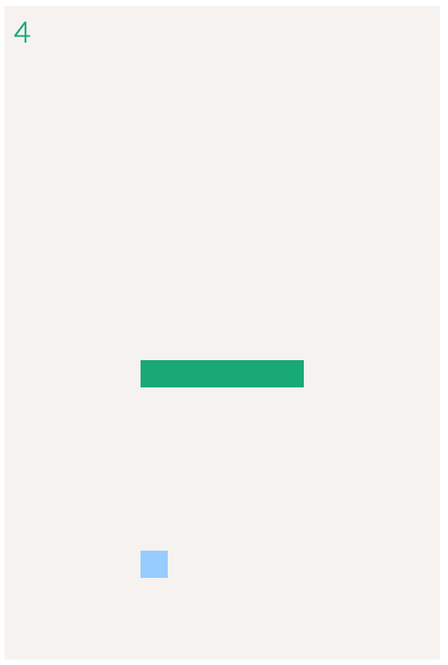

# Snake

Experimenting with [Elm](http://elm-lang.org/) (so much awesome) to build a Snake game while trying to keep the source code structured.

Also with Webpack 2 + hot reload + Yarn so now I have my own bleeding edge boilerplate for web development.

[Play it here!](https://jiahaog.github.com/snake)

[](https://jiahaog.github.com/snake)

## Dependencies

- [Node.js](https://nodejs.org)
- [Yarn](https://yarnpkg.com/)

## Setup

First intall the dependencies with Yarn (trust me, it's much faster).
```bash
yarn install
```

You can still use npm though...

```bash
npm install
```

## Usage

### Development

```bash
npm start
```

View the page for development at [http://127.0.0.1:8080/](http://127.0.0.1:8080/).

### Build

```bash
npm run build
```

The files will be output to `./dist/`
